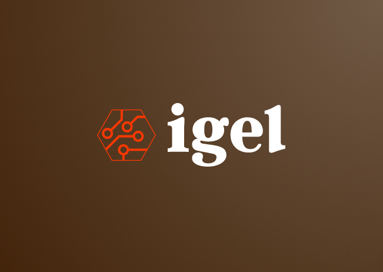

====
igel
====

.. image:: https://img.shields.io/pypi/v/igel.svg
        :target: https://pypi.python.org/pypi/igel

.. image:: https://img.shields.io/travis/nidhaloff/igel.svg
        :target: https://travis-ci.com/nidhaloff/igel

.. image:: https://readthedocs.org/projects/igel/badge/?version=latest
        :target: https://igel.readthedocs.io/en/latest/?badge=latest
        :alt: Documentation Status

a machine learning tool that allows to train, test and use models without writing code

* Free software: MIT license
* Documentation: https://igel.readthedocs.io.

Features
--------

* TODO

Credits
-------

This package was created with Cookiecutter_ and the `audreyr/cookiecutter-pypackage`_ project template.

.. _Cookiecutter: https://github.com/audreyr/cookiecutter
.. _`audreyr/cookiecutter-pypackage`: https://github.com/audreyr/cookiecutter-pypackage
