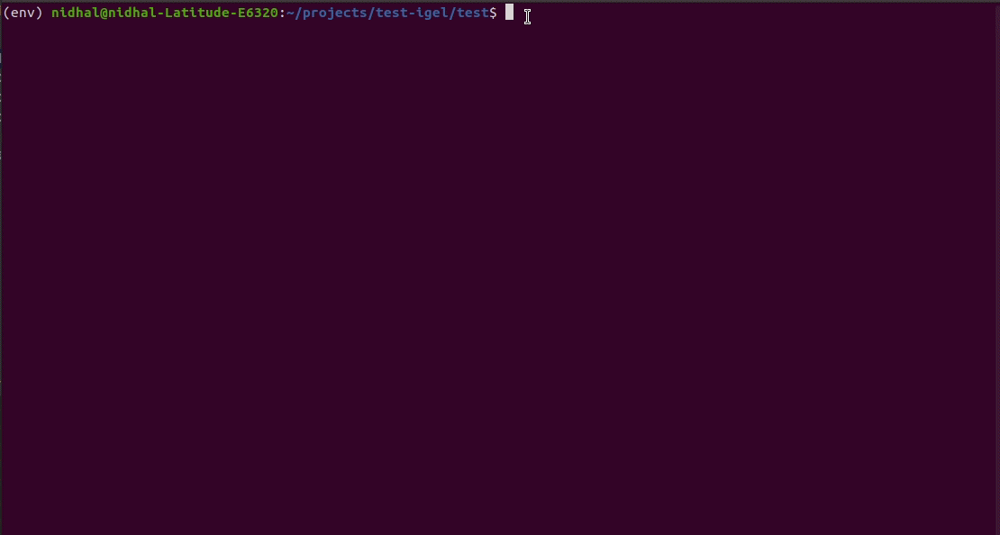
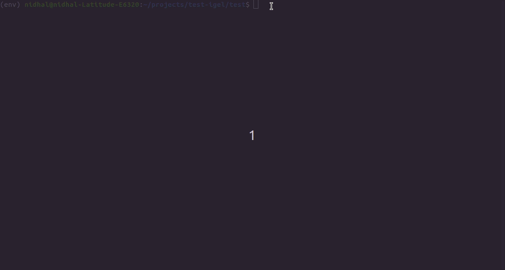
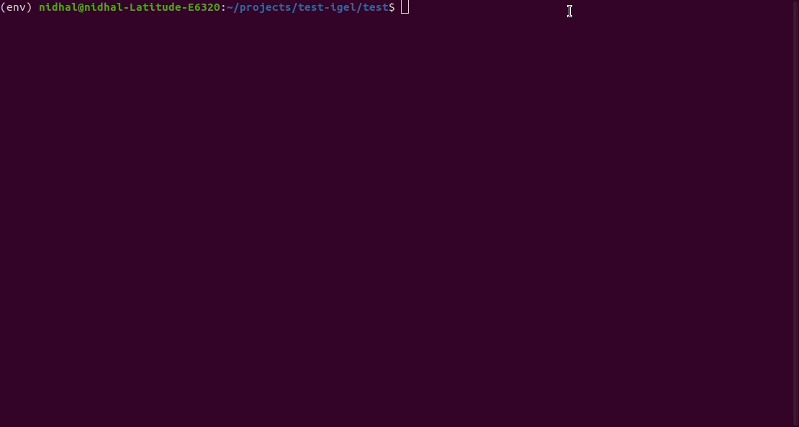
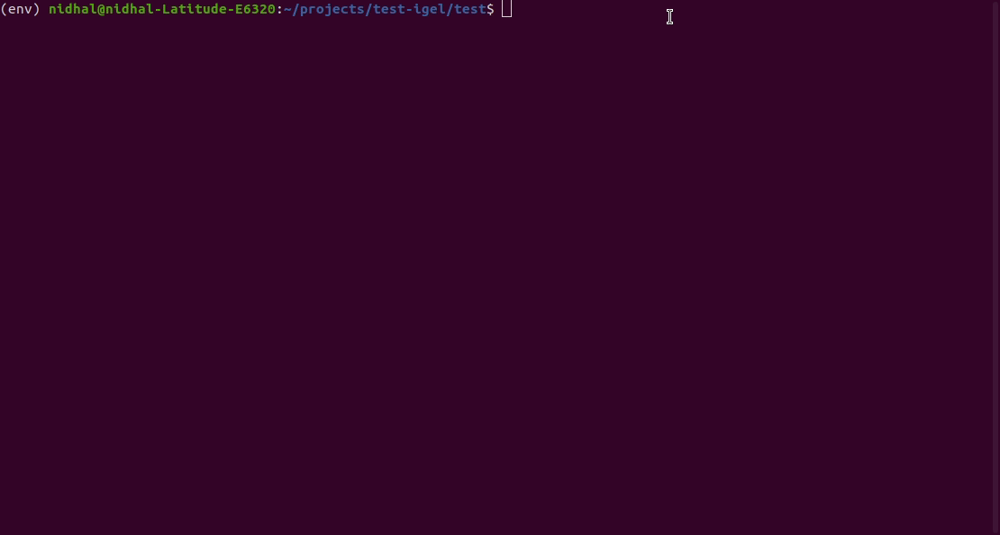

====
igel
====

|

|

.. image:: https://img.shields.io/pypi/v/igel?color=green
        :alt: PyPI
        :target: https://pypi.python.org/pypi/igel

.. image:: https://img.shields.io/travis/nidhaloff/igel.svg
        :target: https://travis-ci.com/nidhaloff/igel

.. image:: https://pepy.tech/badge/igel
        :target: https://pepy.tech/project/igel

.. image:: https://pepy.tech/badge/igel/month
        :target: https://pepy.tech/project/igel/month

.. image:: https://readthedocs.org/projects/igel/badge/?version=latest
        :target: https://igel.readthedocs.io/en/latest/?badge=latest
        :alt: Documentation Status

.. image:: https://img.shields.io/pypi/wheel/igel
        :alt: PyPI - Wheel
        :target: https://pypi.python.org/pypi/igel

.. image:: https://img.shields.io/pypi/status/igel
        :alt: PyPI - Status
        :target: https://pypi.python.org/pypi/igel

.. image:: https://img.shields.io/twitter/url?url=https%3A%2F%2Ftwitter.com%2FNidhalBaccouri
        :alt: Twitter URL
        :target: https://twitter.com/NidhalBaccouri

|
|

A delightful machine learning tool that allows you to train/fit, test and use models **without writing code**

* Free software: MIT license
* Documentation: https://igel.readthedocs.io.

.. contents:: Table of Contents
    :depth: 3

|
|

Motivation & Goal
------------------

The goal of the project is to provide machine learning for **everyone**, both technical and non-technical
users.

I needed a tool sometimes, which I can use to fast create a machine learning prototype. Whether to build
some proof of concept or create a fast draft model to prove a point. I find myself often stuck at writing
boilerplate code and/or thinking too much of how to start this.

Therefore, I decided to create **igel**. Hopefully, it will make it easier for technical and non-technical
users to build machine learning models.

Features
---------
- Supports all state of the art machine learning models (even preview models)
- Supports different data preprocessing methods
- Provides flexibility and data control while writing configurations
- Supports cross validation
- Supports both hyperparameter search (version >= 0.2.8)
- Supports yaml and json format
- Supports different sklearn metrics for regression, classification and clustering
- Supports multi-output/multi-target regression and classification
- Supports multi-processing for parallel model construction

Intro
--------

igel is built on top of scikit-learn. It provides a simple way to use machine learning without writing
a **single line of code**

All you need is a **yaml** (or **json**) file, where you need to describe what you are trying to do. That's it!

Igel supports all sklearn's machine learning functionality, whether regression, classification or clustering.
Precisely, you can use **63** different machine learning model in igel.

Installation
-------------

- The easiest way is to install igel using `pip <https://packaging.python.org/guides/tool-recommendations/>`_

.. code-block:: console

    $ pip install -U igel

- Check the docs for other ways to install igel from source

Models
-------

Igel's supported models:

.. code-block:: console

        +--------------------+----------------------------+-------------------------+
        |      regression    |        classification      |        clustering       |
        +--------------------+----------------------------+-------------------------+
        |   LinearRegression |         LogisticRegression |                  KMeans |
        |              Lasso |                      Ridge |     AffinityPropagation |
        |          LassoLars |               DecisionTree |                   Birch |
        | BayesianRegression |                  ExtraTree | AgglomerativeClustering |
        |    HuberRegression |               RandomForest |    FeatureAgglomeration |
        |              Ridge |                 ExtraTrees |                  DBSCAN |
        |  PoissonRegression |                        SVM |         MiniBatchKMeans |
        |      ARDRegression |                  LinearSVM |    SpectralBiclustering |
        |  TweedieRegression |                      NuSVM |    SpectralCoclustering |
        | TheilSenRegression |            NearestNeighbor |      SpectralClustering |
        |    GammaRegression |              NeuralNetwork |               MeanShift |
        |   RANSACRegression | PassiveAgressiveClassifier |                  OPTICS |
        |       DecisionTree |                 Perceptron |                    ---- |
        |          ExtraTree |               BernoulliRBM |                    ---- |
        |       RandomForest |           BoltzmannMachine |                    ---- |
        |         ExtraTrees |       CalibratedClassifier |                    ---- |
        |                SVM |                   Adaboost |                    ---- |
        |          LinearSVM |                    Bagging |                    ---- |
        |              NuSVM |           GradientBoosting |                    ---- |
        |    NearestNeighbor |        BernoulliNaiveBayes |                    ---- |
        |      NeuralNetwork |      CategoricalNaiveBayes |                    ---- |
        |         ElasticNet |       ComplementNaiveBayes |                    ---- |
        |       BernoulliRBM |         GaussianNaiveBayes |                    ---- |
        |   BoltzmannMachine |      MultinomialNaiveBayes |                    ---- |
        |           Adaboost |                       ---- |                    ---- |
        |            Bagging |                       ---- |                    ---- |
        |   GradientBoosting |                       ---- |                    ---- |
        +--------------------+----------------------------+-------------------------+

Quick Start
------------

Run :code:`igel version` to check the version.

Run :code:`igel info` to get meta data about the project.

You can run the help command to get instructions:

.. code-block:: console

    $ igel --help

    # or just

    $ igel -h
    """
    Take some time and read the output of help command. You ll save time later if you understand how to use igel.
    """

- Demo:

.. image:: assets/igel-help.gif

---------------------------------------------------------------------------------------------------------

First step is to provide a yaml file (you can also use json if you want)

You can do this manually by creating a .yaml file (called igel.yaml by convention but you can name if whatever you want)
and editing it yourself.
However, if you are lazy (and you probably are, like me :D), you can use the igel init command to get started fast,
which will create a basic config file for you on the fly.

.. code-block:: console

    """
    igel init <args>
    possible optional args are: (notice that these args are optional, so you can also just run igel init if you want)
    -type: regression, classification or clustering
    -model: model you want to use
    -target: target you want to predict

    Example:
    If I want to use neural networks to classify whether someone is sick or not using the indian-diabetes dataset,
    then I would use this command to initliaze a yaml file:
    $ igel init -type "classification" -model "NeuralNetwork" -target "sick"
    """
    $ igel init

After runnig the command, an igel.yaml file will be created for you in the current working directory. You can
check it out and modify it if you want to, otherwise you can also create everything from scratch.

- Demo:

-----------------------------------------------------------------------------------------------------------

.. code-block:: yaml

        # model definition
        model:
            # in the type field, you can write the type of problem you want to solve. Whether regression, classification or clustering
            # Then, provide the algorithm you want to use on the data. Here I'm using the random forest algorithm
            type: classification
            algorithm: RandomForest     # make sure you write the name of the algorithm in pascal case
            arguments:
                n_estimators: 100   # here, I set the number of estimators (or trees) to 100
                max_depth: 30       # set the max_depth of the tree

        # target you want to predict
        # Here, as an example, I'm using the famous indians-diabetes dataset, where I want to predict whether someone have diabetes or not.
        # Depending on your data, you need to provide the target(s) you want to predict here
        target:
            - sick

In the example above, I'm using random forest to classify whether someone have
diabetes or not depending on some features in the dataset
I used the famous indian diabetes in this example `indian-diabetes dataset <https://www.kaggle.com/uciml/pima-indians-diabetes-database>`_)

Notice that I passed :code:`n_estimators` and :code:`max_depth` as additional arguments to the model.
If you don't provide arguments then the default will be used.
You don't have to memorize the arguments for each model. You can always run :code:`igel models` in your terminal, which will
get you to interactive mode, where you will be prompted to enter the model you want to use and type of the problem
you want to solve. Igel will then show you information about the model and a link that you can follow to see
a list of available arguments and how to use these.

- The expected way to use igel is from terminal (igel CLI):

Run this command in terminal to fit/train a model, where you provide the **path to your dataset** and the **path to the yaml file**

.. code-block:: console

    $ igel fit --data_path 'path_to_your_csv_dataset.csv' --yaml_file 'path_to_your_yaml_file.yaml'

    # or shorter

    $ igel fit -dp 'path_to_your_csv_dataset.csv' -yml 'path_to_your_yaml_file.yaml'

    """
    That's it. Your "trained" model can be now found in the model_results folder
    (automatically created for you in your current working directory).
    Furthermore, a description can be found in the description.json file inside the model_results folder.
    """

- Demo:

--------------------------------------------------------------------------------------------------------

You can then evaluate the trained/pre-fitted model:

.. code-block:: console

    $ igel evaluate -dp 'path_to_your_evaluation_dataset.csv'
    """
    This will automatically generate an evaluation.json file in the current directory, where all evaluation results are stored
    """

- Demo:

------------------------------------------------------------------------------------------------------

Finally, you can use the trained/pre-fitted model to make predictions if you are happy with the evaluation results:

.. code-block:: console

    $ igel predict -dp 'path_to_your_test_dataset.csv'
    """
    This will generate a predictions.csv file in your current directory, where all predictions are stored in a csv file
    """

- Demo:

.. image:: assets/igel-predict.gif

----------------------------------------------------------------------------------------------------------

You can combine the train, evaluate and predict phases using one single command called experiment:

.. code-block:: console

    $ igel experiment -DP "path_to_train_data path_to_eval_data path_to_test_data" -yml "path_to_yaml_file"

    """
    This will run fit using train_data, evaluate using eval_data and further generate predictions using the test_data
    """

- Demo:

.. image:: assets/igel-experiment.gif

- Alternatively, you can also write code if you want to:

..  code-block:: python

    from igel import Igel

    # provide the arguments in a dictionary
    params = {
            'cmd': 'fit',    # provide the command you want to use. whether fit, evaluate or predict
            'data_path': 'path_to_your_dataset',
            'yaml_path': 'path_to_your_yaml_file'
    }

    Igel(**params)
    """
    check the examples folder for more
    """

Interactive Mode
------------------

Interactive mode is new in >= v0.2.6

This mode basically offers you the freedom to write arguments on your way.
You are not restricted to write the arguments directly when using the command.

This means practically that you can use the commands (fit, evaluate, predict, experiment etc..)
without specifying any additional arguments. For example:

..  code-block:: python

    igel fit

if you just write this and click enter, you will be prompted to provide the additional mandatory arguments.
Any version <= 0.2.5 will throw an error in this case, which why you need to make sure that you have
a >= 0.2.6 version.

- Demo (init command):

.. image:: assets/igel-init-interactive.gif

- Demo (fit command):

.. image:: assets/igel-fit-interactive.gif

As you can see, you don't need to memorize the arguments, you can just let igel ask you to enter them.
Igel will provide you with a nice message explaining which argument you need to enter.

The value between brackets represents the default value. This means if you provide no value and hit return,
then the value between brackets will be taken as the default value.

Overview
----------
The main goal of igel is to provide you with a way to train/fit, evaluate and use models without writing code.
Instead, all you need is to provide/describe what you want to do in a simple yaml file.

Basically, you provide description or rather configurations in the yaml file as key value pairs.
Here is an overview of all supported configurations (for now):

.. code-block:: yaml

    # dataset operations
    dataset:
        type: csv  # [str] -> type of your dataset
        read_data_options: # options you want to supply for reading your data (See the detailed overview about this in the next section)
            sep:  # [str] -> Delimiter to use.
            delimiter:  # [str] -> Alias for sep.
            header:     # [int, list of int] -> Row number(s) to use as the column names, and the start of the data.
            names:  # [list] -> List of column names to use
            index_col: # [int, str, list of int, list of str, False] -> Column(s) to use as the row labels of the DataFrame,
            usecols:    # [list, callable] -> Return a subset of the columns
            squeeze:    # [bool] -> If the parsed data only contains one column then return a Series.
            prefix:     # [str] -> Prefix to add to column numbers when no header, e.g. ‘X’ for X0, X1, …
            mangle_dupe_cols:   # [bool] -> Duplicate columns will be specified as ‘X’, ‘X.1’, …’X.N’, rather than ‘X’…’X’. Passing in False will cause data to be overwritten if there are duplicate names in the columns.
            dtype:  # [Type name, dict maping column name to type] -> Data type for data or columns
            engine:     # [str] -> Parser engine to use. The C engine is faster while the python engine is currently more feature-complete.
            converters: # [dict] -> Dict of functions for converting values in certain columns. Keys can either be integers or column labels.
            true_values: # [list] -> Values to consider as True.
            false_values: # [list] -> Values to consider as False.
            skipinitialspace: # [bool] -> Skip spaces after delimiter.
            skiprows: # [list-like] -> Line numbers to skip (0-indexed) or number of lines to skip (int) at the start of the file.
            skipfooter: # [int] -> Number of lines at bottom of file to skip
            nrows: # [int] -> Number of rows of file to read. Useful for reading pieces of large files.
            na_values: # [scalar, str, list, dict] ->  Additional strings to recognize as NA/NaN.
            keep_default_na: # [bool] ->  Whether or not to include the default NaN values when parsing the data.
            na_filter: # [bool] -> Detect missing value markers (empty strings and the value of na_values). In data without any NAs, passing na_filter=False can improve the performance of reading a large file.
            verbose: # [bool] -> Indicate number of NA values placed in non-numeric columns.
            skip_blank_lines: # [bool] -> If True, skip over blank lines rather than interpreting as NaN values.
            parse_dates: # [bool, list of int, list of str, list of lists, dict] ->  try parsing the dates
            infer_datetime_format: # [bool] -> If True and parse_dates is enabled, pandas will attempt to infer the format of the datetime strings in the columns, and if it can be inferred, switch to a faster method of parsing them.
            keep_date_col: # [bool] -> If True and parse_dates specifies combining multiple columns then keep the original columns.
            dayfirst: # [bool] -> DD/MM format dates, international and European format.
            cache_dates: # [bool] -> If True, use a cache of unique, converted dates to apply the datetime conversion.
            thousands: # [str] -> the thousands operator
            decimal: # [str] -> Character to recognize as decimal point (e.g. use ‘,’ for European data).
            lineterminator: # [str] -> Character to break file into lines.
            escapechar: # [str] ->  One-character string used to escape other characters.
            comment: # [str] -> Indicates remainder of line should not be parsed. If found at the beginning of a line, the line will be ignored altogether. This parameter must be a single character.
            encoding: # [str] -> Encoding to use for UTF when reading/writing (ex. ‘utf-8’).
            dialect: # [str, csv.Dialect] -> If provided, this parameter will override values (default or not) for the following parameters: delimiter, doublequote, escapechar, skipinitialspace, quotechar, and quoting
            delim_whitespace: # [bool] -> Specifies whether or not whitespace (e.g. ' ' or '    ') will be used as the sep
            low_memory: # [bool] -> Internally process the file in chunks, resulting in lower memory use while parsing, but possibly mixed type inference.
            memory_map: # [bool] -> If a filepath is provided for filepath_or_buffer, map the file object directly onto memory and access the data directly from there. Using this option can improve performance because there is no longer any I/O overhead.

        split:  # split options
            test_size: 0.2  #[float] -> 0.2 means 20% for the test data, so 80% are automatically for training
            shuffle: true   # [bool] -> whether to shuffle the data before/while splitting
            stratify: None  # [list, None] -> If not None, data is split in a stratified fashion, using this as the class labels.

        preprocess: # preprocessing options
            missing_values: mean    # [str] -> other possible values: [drop, median, most_frequent, constant] check the docs for more
            encoding:
                type: oneHotEncoding  # [str] -> other possible values: [labelEncoding]
            scale:  # scaling options
                method: standard    # [str] -> standardization will scale values to have a 0 mean and 1 standard deviation  | you can also try minmax
                target: inputs  # [str] -> scale inputs. | other possible values: [outputs, all] # if you choose all then all values in the dataset will be scaled

    # model definition
    model:
        type: classification    # [str] -> type of the problem you want to solve. | possible values: [regression, classification, clustering]
        algorithm: NeuralNetwork    # [str (notice the pascal case)] -> which algorithm you want to use. | type igel algorithms in the Terminal to know more
        arguments:          # model arguments: you can check the available arguments for each model by running igel help in your terminal
        use_cv_estimator: false     # [bool] -> if this is true, the CV class of the specific model will be used if it is supported
        cross_validate:
            cv: # [int] -> number of kfold (default 5)
            n_jobs:   # [signed int] -> The number of CPUs to use to do the computation (default None)
            verbose: # [int] -> The verbosity level. (default 0)
        hyperparameter_search:
            method: grid_search   # method you want to use: grid_search and random_search are supported
            parameter_grid:     # put your parameters grid here that you want to use, an example is provided below
                param1: [val1, val2]
                param2: [val1, val2]
            arguments:  # additional arguments you want to provide for the hyperparameter search
                cv: 5   # number of folds
                refit: true   # whether to refit the model after the search
                return_train_score: false   # whether to return the train score
                verbose: 0      # verbosity level

    # target you want to predict
    target:  # list of strings: basically put here the column(s), you want to predict that exist in your csv dataset
        - put the target you want to predict here
        - you can assign many target if you are making a multioutput prediction

Read Data Options
------------------

.. note::
    igel uses pandas under the hood to read & parse the data. Hence, you can
    find this data optional parameters also in the pandas official documentation.

A detailed overview of the configurations you can provide in the yaml (or json) file is given below.
Notice that you will certainly not need all the configuration values for the dataset. They are optional.
Generally, igel will figure out how to read your dataset.

However, you can help it by providing extra fields using this read_data_options section.
For example, one of the helpful values in my opinion is the "sep", which defines how your columns
in the csv dataset are separated. Generally, csv datasets are separated by commas, which is also the default value
here. However, it may be separated by a semi column in your case.

Hence, you can provide this in the read_data_options. Just add the :code:`sep: ";"` under read_data_options.

.. list-table:: Supported Read Data Options
   :widths: 25 25 50
   :header-rows: 1

   * - Parameter
     - Type
     - Explanation
   * - sep
     - str, default ‘,’
     - Delimiter to use. If sep is None, the C engine cannot automatically detect the separator, but the Python parsing engine can, meaning the latter will be used and automatically detect the separator by Python’s builtin sniffer tool, csv.Sniffer. In addition, separators longer than 1 character and different from '\s+' will be interpreted as regular expressions and will also force the use of the Python parsing engine. Note that regex delimiters are prone to ignoring quoted data. Regex example: '\r\t'.
   * - delimiter
     - default None
     - Alias for sep.
   * - header
     - int, list of int, default ‘infer’
     - Row number(s) to use as the column names, and the start of the data. Default behavior is to infer the column names: if no names are passed the behavior is identical to header=0 and column names are inferred from the first line of the file, if column names are passed explicitly then the behavior is identical to header=None. Explicitly pass header=0 to be able to replace existing names. The header can be a list of integers that specify row locations for a multi-index on the columns e.g. [0,1,3]. Intervening rows that are not specified will be skipped (e.g. 2 in this example is skipped). Note that this parameter ignores commented lines and empty lines if skip_blank_lines=True, so header=0 denotes the first line of data rather than the first line of the file.
   * - names
     - array-like, optional
     - List of column names to use. If the file contains a header row, then you should explicitly pass header=0 to override the column names. Duplicates in this list are not allowed.
   * - index_col
     - int, str, sequence of int / str, or False, default None
     - Column(s) to use as the row labels of the DataFrame, either given as string name or column index. If a sequence of int / str is given, a MultiIndex is used. Note: index_col=False can be used to force pandas to not use the first column as the index, e.g. when you have a malformed file with delimiters at the end of each line.
   * - usecols
     - list-like or callable, optional
     - Return a subset of the columns. If list-like, all elements must either be positional (i.e. integer indices into the document columns) or strings that correspond to column names provided either by the user in names or inferred from the document header row(s). For example, a valid list-like usecols parameter would be [0, 1, 2] or ['foo', 'bar', 'baz']. Element order is ignored, so usecols=[0, 1] is the same as [1, 0]. To instantiate a DataFrame from data with element order preserved use pd.read_csv(data, usecols=['foo', 'bar'])[['foo', 'bar']] for columns in ['foo', 'bar'] order or pd.read_csv(data, usecols=['foo', 'bar'])[['bar', 'foo']] for ['bar', 'foo'] order. If callable, the callable function will be evaluated against the column names, returning names where the callable function evaluates to True. An example of a valid callable argument would be lambda x: x.upper() in ['AAA', 'BBB', 'DDD']. Using this parameter results in much faster parsing time and lower memory usage.
   * - squeeze
     - bool, default False
     - If the parsed data only contains one column then return a Series.

   * - prefix
     - str, optional
     - Prefix to add to column numbers when no header, e.g. ‘X’ for X0, X1, …
   * - mangle_dupe_cols
     - bool, default True
     - Duplicate columns will be specified as ‘X’, ‘X.1’, …’X.N’, rather than ‘X’…’X’. Passing in False will cause data to be overwritten if there are duplicate names in the columns.
   * - dtype
     - {‘c’, ‘python’}, optional
     - Parser engine to use. The C engine is faster while the python engine is currently more feature-complete.
   * - converters
     - dict, optional
     - Dict of functions for converting values in certain columns. Keys can either be integers or column labels.
   * - true_values
     - list, optional
     - Values to consider as True.

   * - false_values
     - list, optional
     - Values to consider as False.
   * - skipinitialspace
     - bool, default False
     - Skip spaces after delimiter.
   * - skiprows
     - list-like, int or callable, optional
     - Line numbers to skip (0-indexed) or number of lines to skip (int) at the start of the file. If callable, the callable function will be evaluated against the row indices, returning True if the row should be skipped and False otherwise. An example of a valid callable argument would be lambda x: x in [0, 2].
   * - skipfooter
     - int, default 0
     - Number of lines at bottom of file to skip (Unsupported with engine=’c’).
   * - nrows
     - int, optional
     - Number of rows of file to read. Useful for reading pieces of large files.
   * - na_values
     - scalar, str, list-like, or dict, optional
     - Additional strings to recognize as NA/NaN. If dict passed, specific per-column NA values. By default the following values are interpreted as NaN: ‘’, ‘#N/A’, ‘#N/A N/A’, ‘#NA’, ‘-1.#IND’, ‘-1.#QNAN’, ‘-NaN’, ‘-nan’, ‘1.#IND’, ‘1.#QNAN’, ‘<NA>’, ‘N/A’, ‘NA’, ‘NULL’, ‘NaN’, ‘n/a’, ‘nan’, ‘null’.
   * - keep_default_na
     - bool, default True
     - Whether or not to include the default NaN values when parsing the data. Depending on whether na_values is passed in, the behavior is as follows: If keep_default_na is True, and na_values are specified, na_values is appended to the default NaN values used for parsing. If keep_default_na is True, and na_values are not specified, only the default NaN values are used for parsing. If keep_default_na is False, and na_values are specified, only the NaN values specified na_values are used for parsing. If keep_default_na is False, and na_values are not specified, no strings will be parsed as NaN. Note that if na_filter is passed in as False, the keep_default_na and na_values parameters will be ignored.
   * - na_filter
     - bool, default True
     - Detect missing value markers (empty strings and the value of na_values). In data without any NAs, passing na_filter=False can improve the performance of reading a large file.
   * - verbose
     - bool, default False
     - Indicate number of NA values placed in non-numeric columns.
   * - skip_blank_lines
     - bool, default True
     - If True, skip over blank lines rather than interpreting as NaN values.
   * - parse_dates
     - bool or list of int or names or list of lists or dict, default False
     - The behavior is as follows: boolean. If True -> try parsing the index. list of int or names. e.g. If [1, 2, 3] -> try parsing columns 1, 2, 3 each as a separate date column. list of lists. e.g. If [[1, 3]] -> combine columns 1 and 3 and parse as a single date column. dict, e.g. {‘foo’ : [1, 3]} -> parse columns 1, 3 as date and call result ‘foo’ If a column or index cannot be represented as an array of datetimes, say because of an unparseable value or a mixture of timezones, the column or index will be returned unaltered as an object data type.
   * - infer_datetime_format
     - bool, default False
     - If True and parse_dates is enabled, pandas will attempt to infer the format of the datetime strings in the columns, and if it can be inferred, switch to a faster method of parsing them. In some cases this can increase the parsing speed by 5-10x.
   * - keep_date_col
     - bool, default False
     - If True and parse_dates specifies combining multiple columns then keep the original columns.
   * - date_parser
     - function, optional
     - Function to use for converting a sequence of string columns to an array of datetime instances. The default uses dateutil.parser.parser to do the conversion. Pandas will try to call date_parser in three different ways, advancing to the next if an exception occurs: 1) Pass one or more arrays (as defined by parse_dates) as arguments; 2) concatenate (row-wise) the string values from the columns defined by parse_dates into a single array and pass that; and 3) call date_parser once for each row using one or more strings (corresponding to the columns defined by parse_dates) as arguments.
   * - dayfirst
     - bool, default False
     - DD/MM format dates, international and European format.

   * - cache_dates
     - bool, default True
     - If True, use a cache of unique, converted dates to apply the datetime conversion. May produce significant speed-up when parsing duplicate date strings, especially ones with timezone offsets.
   * - thousands
     - str, optional
     - Thousands separator.
   * - decimal
     - str, default ‘.’
     - Character to recognize as decimal point (e.g. use ‘,’ for European data).
   * - lineterminator
     - str (length 1), optional
     - Character to break file into lines. Only valid with C parser.
   * - escapechar
     - str (length 1), optional
     - One-character string used to escape other characters.
   * - comment
     - str, optional
     - Indicates remainder of line should not be parsed. If found at the beginning of a line, the line will be ignored altogether.
   * - encoding
     - str, optional
     - Encoding to use for UTF when reading/writing (ex. ‘utf-8’).
   * - dialect
     - str or csv.Dialect, optional
     - If provided, this parameter will override values (default or not) for the following parameters: delimiter, doublequote, escapechar, skipinitialspace, quotechar, and quoting
   * - low_memory
     - bool, default True
     - Internally process the file in chunks, resulting in lower memory use while parsing, but possibly mixed type inference. To ensure no mixed types either set False, or specify the type with the dtype parameter. Note that the entire file is read into a single DataFrame regardless,
   * - memory_map
     - bool, default False
     - map the file object directly onto memory and access the data directly from there. Using this option can improve performance because there is no longer any I/O overhead.

E2E Example
-----------

A complete end to end solution is provided in this section to prove the capabilities of **igel**.
As explained previously, you need to create a yaml configuration file. Here is an end to end example for
predicting whether someone have diabetes or not using the **decision tree** algorithm. The dataset can be found in the examples folder.

-  **Fit/Train a model**:

.. code-block:: yaml

        model:
            type: classification
            algorithm: DecisionTree

        target:
            - sick

.. code-block:: console

    $ igel fit -dp path_to_the_dataset -yml path_to_the_yaml_file

That's it, igel will now fit the model for you and save it in a model_results folder in your current directory.

- **Evaluate the model**:

Evaluate the pre-fitted model. Igel will load the pre-fitted model from the model_results directory and evaluate it for you.
You just need to run the evaluate command and provide the path to your evaluation data.

.. code-block:: console

    $ igel evaluate -dp path_to_the_evaluation_dataset

That's it! Igel will evaluate the model and store statistics/results in an **evaluation.json** file inside the model_results folder

- **Predict**:

Use the pre-fitted model to predict on new data. This is done automatically by igel, you just need to provide the
path to your data that you want to use prediction on.

.. code-block:: console

    $ igel predict -dp path_to_the_new_dataset

That's it! Igel will use the pre-fitted model to make predictions and save it in a **predictions.csv** file inside the model_results folder

Advanced Usage
---------------

You can also carry out some preprocessing methods or other operations by providing them in the yaml file.
Here is an example, where the data is split to 80% for training and 20% for validation/testing.
Also, the data are shuffled while splitting.

Furthermore, the data are preprocessed by replacing missing values with the mean ( you can also use median, mode etc..).
check `this link <https://www.kaggle.com/uciml/pima-indians-diabetes-database>`_ for more information

.. code-block:: yaml

        # dataset operations
        dataset:
            split:
                test_size: 0.2
                shuffle: True
                stratify: default

            preprocess: # preprocessing options
                missing_values: mean    # other possible values: [drop, median, most_frequent, constant] check the docs for more
                encoding:
                    type: oneHotEncoding  # other possible values: [labelEncoding]
                scale:  # scaling options
                    method: standard    # standardization will scale values to have a 0 mean and 1 standard deviation  | you can also try minmax
                    target: inputs  # scale inputs. | other possible values: [outputs, all] # if you choose all then all values in the dataset will be scaled

        # model definition
        model:
            type: classification
            algorithm: RandomForest
            arguments:
                # notice that this is the available args for the random forest model. check different available args for all supported models by running igel help
                n_estimators: 100
                max_depth: 20

        # target you want to predict
        target:
            - sick

Then, you can fit the model by running the igel command as shown in the other examples

.. code-block:: console

    $ igel fit -dp path_to_the_dataset -yml path_to_the_yaml_file

For evaluation

.. code-block:: console

    $ igel evaluate -dp path_to_the_evaluation_dataset

For production

.. code-block:: console

    $ igel predict -dp path_to_the_new_dataset

Examples
----------

In the examples folder in the repository, you will find a data folder,where the famous indian-diabetes, iris dataset
and the linnerud (from sklearn) datasets are stored.
Furthermore, there are end to end examples inside each folder, where there are scripts and yaml files that
will help you get started.

The indian-diabetes-example folder contains two examples to help you get started:

- The first example is using a **neural network**, where the configurations are stored in the neural-network.yaml file
- The second example is using a **random forest**, where the configurations are stored in the random-forest.yaml file

The iris-example folder contains a **logistic regression** example, where some preprocessing (one hot encoding)
is conducted on the target column to show you more the capabilities of igel.

Furthermore, the multioutput-example contains a **multioutput regression** example.
Finally, the cv-example contains an example using the Ridge classifier using cross validation.

You can also find a cross validation and a hyperparameter search examples in the folder.

I suggest you play around with the examples and igel cli. However,
you can also directly execute the fit.py, evaluate.py and predict.py if you want to.

Links
------

- Article: https://medium.com/@nidhalbacc/machine-learning-without-writing-code-984b238dd890

Contributions
--------------

You think this project is useful and you want to bring new ideas, new features, bug fixes, extend the docs?

Contributions are always welcome.
Make sure you read `the guidelines <https://igel.readthedocs.io/en/latest/contributing.html>`_ first

License
--------

MIT license

Copyright (c) 2020-present, Nidhal Baccouri
